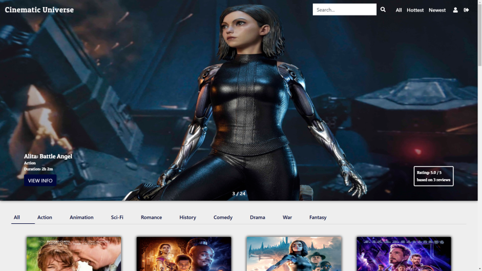
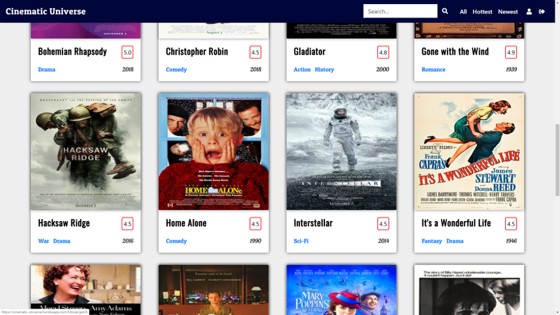
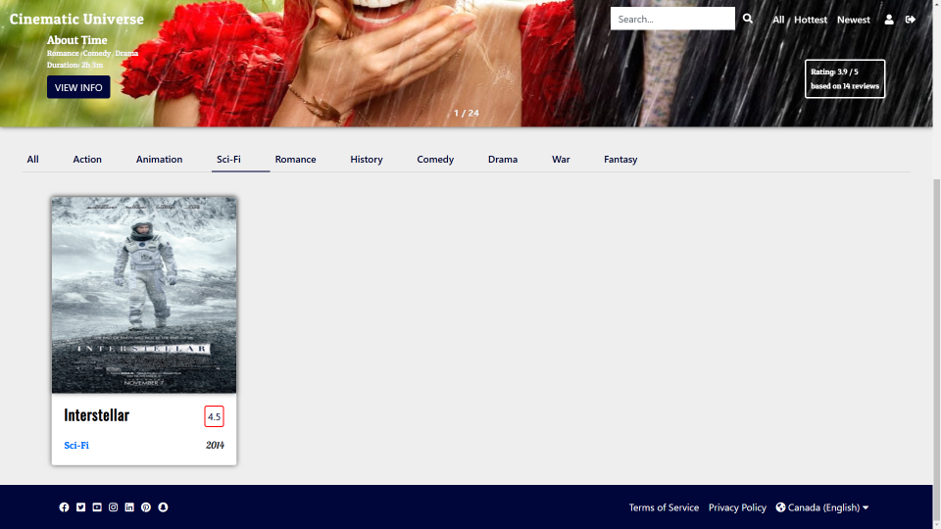
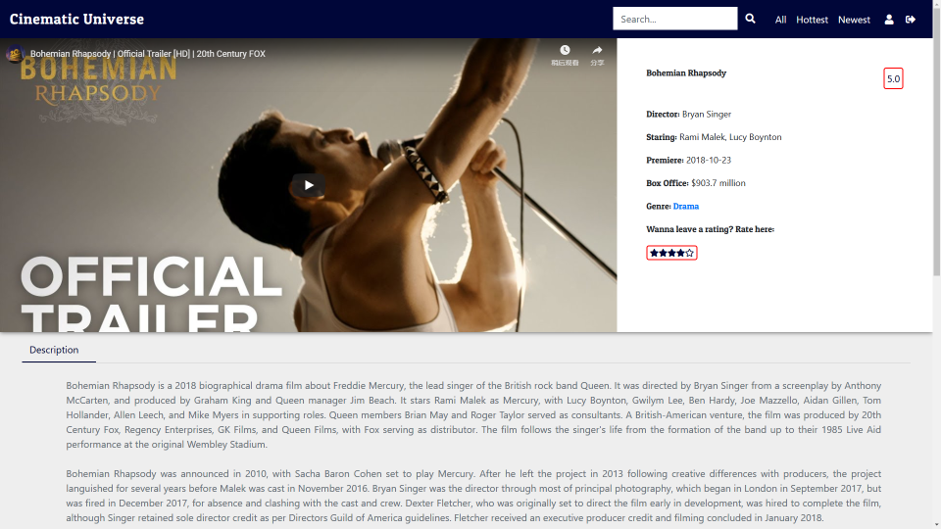
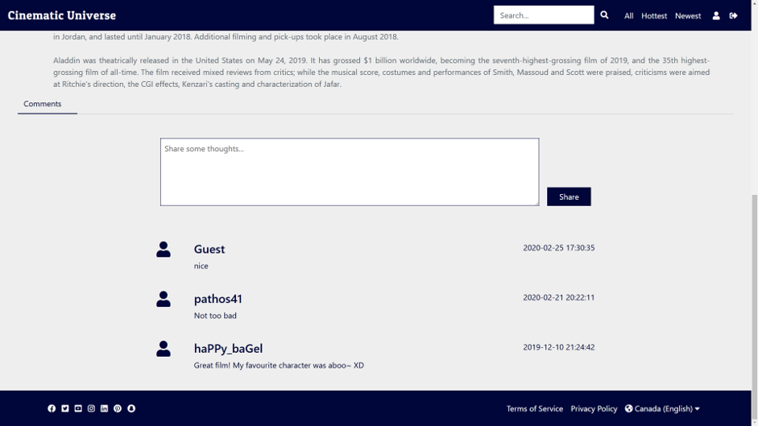
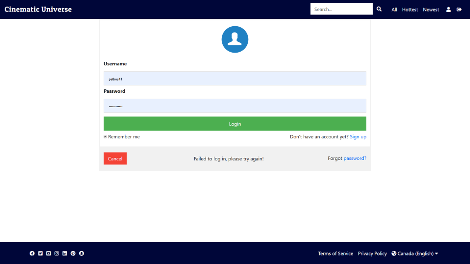
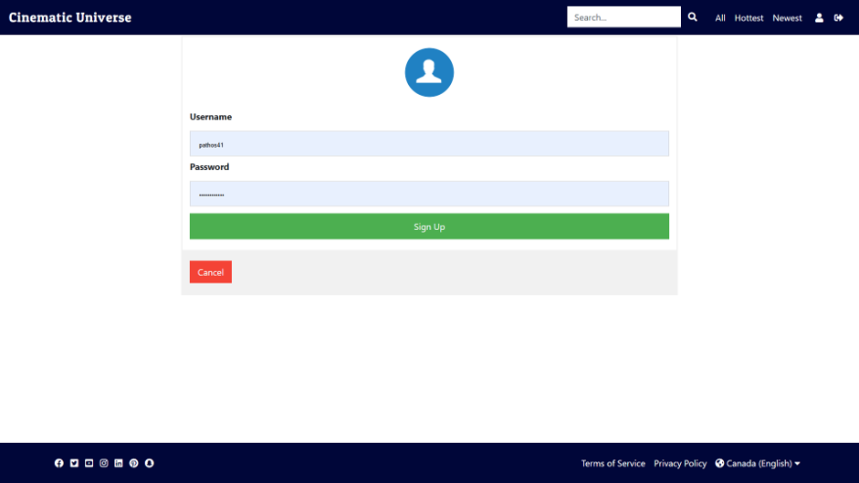

# PHP Movie Website
Visit the website at <a href="https://cinematic-universe.herokuapp.com/">Cinematic Universe</a>.

A single entry point movie website using PHP MVC structure and OOP.

The list of movies, sorted by premiere time by default.

Search for a specific genre of movies.

The movie single page, with trailer on the left and rating on the right.

The comment section at the bottom of the single movie page, username will show as Guest if not logged in.

The login page.

Used PHP for user authentication, and twig as the front end template.

The signup page.

Used Bootstrap 4/CSS 3.0 to develop front end template including animated main page and movie detail page.

Updated front-end page contents such as ratings, generated comments and showed on page dynamically.

Used MySQL database to store data, and used PHP to build connection to the database.

Wrote MySQL queries to retrieve and modify data from the database, and render the template dynamically.

Implemented self-designed Restful API to display the movies by categories and other different sorting criterias.
